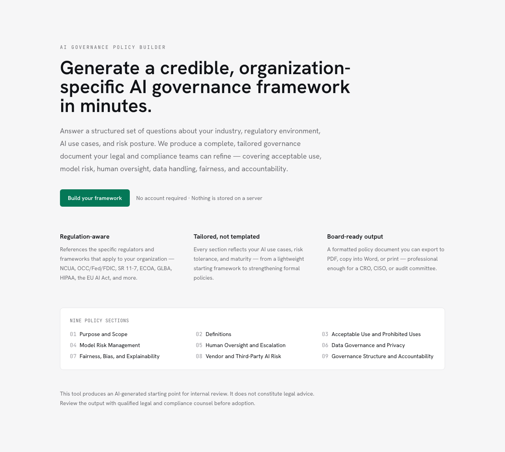

# AI Governance Policy Builder

Generate a credible, organization-specific AI governance framework in minutes.

Answer a structured questionnaire about your industry, regulatory environment,
AI use cases, risk posture, and maturity — and the app produces a complete,
nine-section governance document tailored to your inputs, streamed in real time
from Anthropic Claude.

> **Not legal advice.** Output is an AI-generated starting point for internal
> review. Review with qualified legal and compliance counsel before adoption.

<p align="center">
  
</p>

---

## Features

- **Structured questionnaire** — organization profile, AI usage, risk/maturity,
  and per-area policy priorities, on a single well-spaced page.
- **Regulation-aware prompts** — injects context for NCUA, OCC / Federal Reserve
  / FDIC (SR 11-7), SEC / FINRA, CFPB, HHS / CMS, state insurance / NAIC, FTC,
  and the EU AI Act based on your selections.
- **Nine tailored sections** — Purpose & Scope, Definitions, Acceptable Use,
  Model Risk Management, Human Oversight, Data Governance, Fairness / Bias,
  Vendor Risk, and Governance Structure.
- **Progressive streaming** — sections render as they arrive, with a sticky
  section-navigation sidebar.
- **Export** — download PDF (running header + page numbers), copy as plain text
  for Word, or print. The disclaimer is included in every export.
- **Regenerate** — returns to the form with your inputs preserved.
- **No database, no auth** — configuration and results live in `sessionStorage`;
  nothing is sent to a server except the generation request to Claude.

---

## Tech stack

- **Framework** — Next.js 14 (App Router) + TypeScript
- **Styling** — Tailwind CSS, with a design system defined in [`DESIGN.md`](DESIGN.md)
- **AI** — Anthropic SDK (`@anthropic-ai/sdk`) with streaming
- **Export** — `html2pdf.js` (PDF) + clipboard (plain text)
- **State** — React state + `sessionStorage` only

---

## Getting started

### Prerequisites

- Node.js 18.17+ (developed on Node 21)
- An Anthropic API key

### Install

```bash
npm install
```

### Configure

Copy the example env file and add your key:

```bash
cp .env.example .env
# then edit .env
ANTHROPIC_API_KEY=your_key_here
```

The app builds and every route renders without a key; `/api/policy` returns a
500 JSON error until `ANTHROPIC_API_KEY` is set.

### Run

```bash
npm run dev      # http://localhost:3000
```

### Build / production

```bash
npm run build    # also type-checks and lints the whole project
npm run start
```

### Lint

```bash
npm run lint
```

---

## How it works

1. **Configure** (`/configure`) — `ConfigForm` collects inputs and saves the
   `PolicyConfig` to `sessionStorage`, then routes to the results page.
2. **Generate** (`/api/policy`) — a POST handler builds the system + user prompt
   (`lib/prompts.ts`) and streams the Claude response back as plain text.
3. **Render** (`/results`) — the stream is parsed into numbered sections
   (`lib/parse.ts`) and rendered progressively, with export and regenerate.

The API instructs Claude to emit each section as `## Section N: <Name>`, which
the parser uses to split the document for individual rendering and navigation.

---

## Design

The visual system is documented in [`DESIGN.md`](DESIGN.md) and is the source of
truth for typography, color, spacing, and aesthetic direction.

- **Aesthetic** — engineered / technical-authoritative; precision over decoration.
- **Typography** — Hanken Grotesk (display + body) with JetBrains Mono for
  labels, section numbers, metadata, and tabular data.
- **Color** — true-gray neutrals on `#111317` ink, with a single emerald
  `#047857` accent used sparingly (primary actions, active state, live-stream
  indicator, per-section numbers).

Read `DESIGN.md` before making any visual change.

---

## Project structure

```
app/
  page.tsx                 # Landing page
  configure/page.tsx       # Configuration questionnaire
  results/page.tsx         # Streamed governance document
  api/policy/route.ts      # Calls Claude, streams response
components/
  ConfigForm.tsx           # The four-section questionnaire
  PolicyDocument.tsx       # Assembled document + metadata + disclaimers
  PolicySection.tsx        # Renders one parsed section
  ExportBar.tsx            # PDF / copy / print / regenerate
data/
  industries.ts            # Industries with regulatory context
  regulations.ts           # Regulatory bodies and context strings
  policy-sections.ts       # Nine section definitions
lib/
  config.ts                # PolicyConfig type and form option lists
  prompts.ts               # System + user prompt construction
  parse.ts                 # Splits streamed markdown into sections
  markdown.ts              # Minimal markdown -> HTML renderer
  pdf-export.ts            # Client-side PDF generation
```

---

## Configuration

| Variable            | Required | Description                            |
| ------------------- | -------- | -------------------------------------- |
| `ANTHROPIC_API_KEY` | Yes      | Server-side key used by `/api/policy`. |

The model is set in `app/api/policy/route.ts` (`claude-sonnet-4-6`).

---

## Disclaimer

This tool produces an AI-generated first draft. Regulatory references are
intended to be industry-appropriate but are not exhaustive or guaranteed
current. It does not constitute legal advice. Always review the output with
qualified legal and compliance counsel before adopting any policy.
